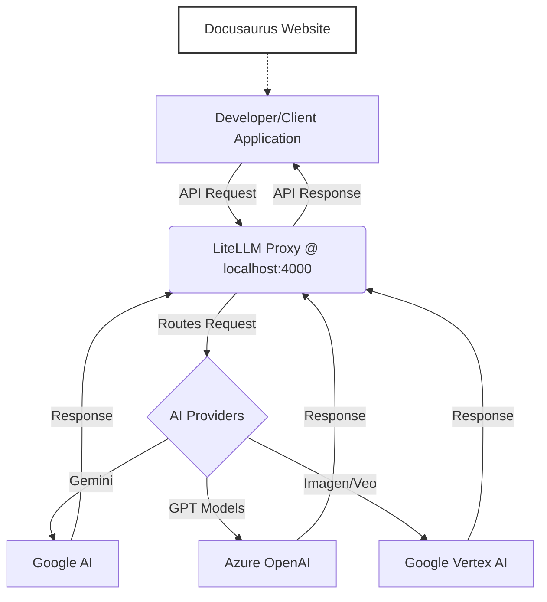

# System Patterns: Kiến trúc và các mẫu thiết kế

## 1. Kiến trúc tổng quan

Hệ thống bao gồm hai thành phần chính:
1.  **LiteLLM Proxy:** Đóng vai trò là một lớp trung gian (middleware), nhận tất cả các yêu cầu API từ client. Nó chịu trách nhiệm xác thực, định tuyến yêu cầu đến đúng nhà cung cấp AI (Google, Azure), và trả kết quả về cho client.
2.  **Docusaurus Website:** Là một trang web tĩnh (static site) được xây dựng để cung cấp tài liệu. Nó không tương tác trực tiếp với Proxy mà chỉ hiển thị thông tin hướng dẫn cách để các ứng dụng khác tương tác.

## 2. Các mẫu thiết kế và quyết định kỹ thuật

- **API Gateway Pattern:** LiteLLM Proxy hoạt động như một API Gateway, cung cấp một điểm truy cập duy nhất cho nhiều dịch vụ backend (trong trường hợp này là các API của nhà cung cấp AI). Điều này giúp che giấu sự phức tạp của hệ thống backend và đơn giản hóa logic phía client.
- **Tuân thủ chuẩn OpenAI:** Proxy được cấu hình để mô phỏng (mimic) API của OpenAI. Đây là một quyết định quan trọng giúp:
    - Tận dụng hệ sinh thái rộng lớn của các công cụ và thư viện client đã có sẵn cho OpenAI.
    - Cung cấp một giao diện quen thuộc, giúp các nhà phát triển dễ dàng tiếp cận.
- **Sử dụng MDX cho tài liệu:** Quyết định chuyển các file tài liệu từ `.md` sang `.mdx` được đưa ra để tận dụng các component React (như Tabs) của Docusaurus. Điều này giúp cải thiện trải nghiệm người dùng bằng cách trình bày thông tin một cách gọn gàng, có tổ chức hơn.
- **Quy trình bất đồng bộ cho các tác vụ dài:** Đối với các tác vụ tốn nhiều thời gian như tạo video, hệ thống sử dụng một quy trình bất đồng bộ (initiate -> poll -> download). Đây là một mẫu thiết kế phổ biến để xử lý các tác vụ dài mà không làm client bị treo (block).
